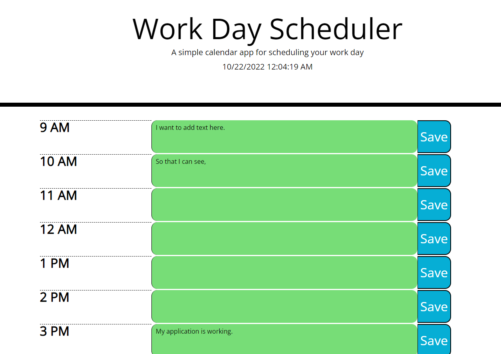

# Work Day Scheduler Challenge

## Description

Add any task or event to any hour block on the scheduler. The 'Save' button will save your task to the browser's local storage. The hour blocks are color coded, based on the past, present, or future tense.  When you refresh the page your task or event will populate in the appropriate field.

## Screenshot

Below is a screenshot of the application.

## Usage

Go to the page: https://eljayman.github.io/05-work-day-scheduler/

Enter a task or event for the hour and save.  If you come back to the application later your event will be saved!

## License

MIT license.
